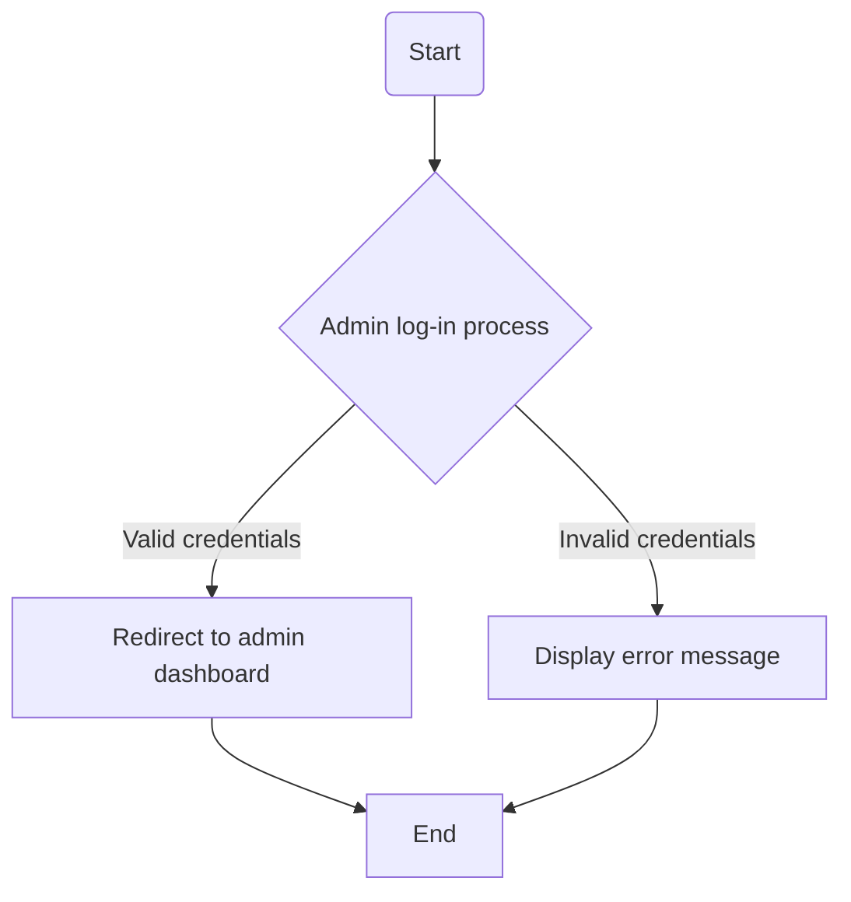
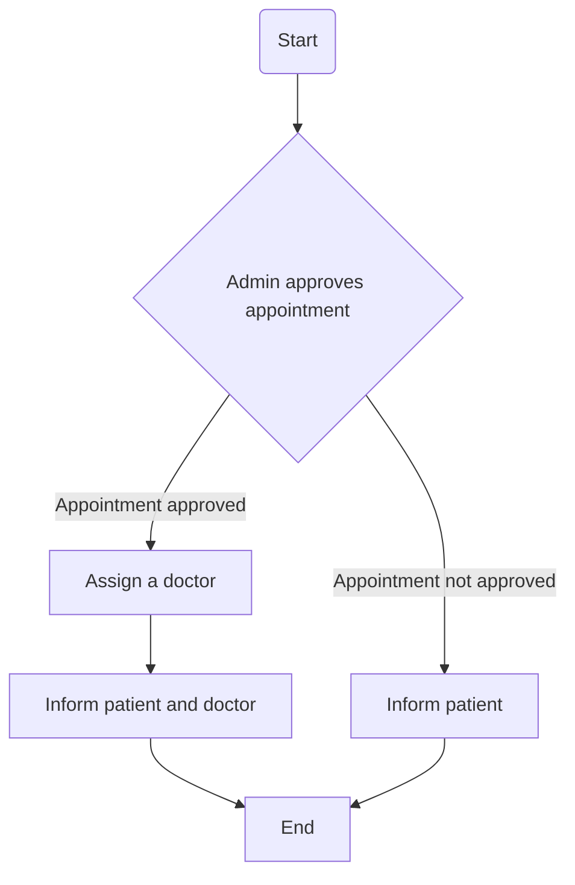

# Design, Development, and Testing of a Computer Programme Solution

## Part A – Design documentation (weight 10%)

### Overview of hospital management systems

In this coursework, students will create a 'prototype' Hospital Management system. This system aims to maintain the medical records of the patient, maintain the contact details of the patient, and keep track of the appointment dates. There are three different types of users involved in a hospital management system: admin, doctor, and patient. Each of the above plays an important role in the hospital management system performing different tasks. Patients using the system can book online appointments. Their appointments are approved by the admin that also assigns a doctor to them.

### Flowchart 1: Admin Log-in Process

### Flowchart 2: Admin Approving an Appointment

## Part B – System development (weight 30%)

### Important:

This part of the assessment should not be attempted by students until you are provided with the partial implementation code which you must use as a starting point of your system, and this will be provided to you around Week 8 of this semester.

Developing your hospital management system from scratch is not acceptable for this assessment, and may lead to losing a substantial amount of marks.

It is critical to use Python 3.6 or a higher version of Python and "Spyder" IDE to ensure that your submission runs correctly when marked by your tutor.

### Description:

#### Rationale

This programming assignment is to apply the programming principles covered in tutorials and lectures to develop a Python software that implements a core hospital management solution that is used by its patients and staff members. The software can be fully implemented using a text-based interface; however, to achieve higher marks, a GUI-based software can be developed using the Python GUI Programming module namely Tkinter. GUI design and Tkinter programming will be covered during week 10. The aim of the exercises is to enhance a student's experience of programming by applying programming principles to a larger problem of developing a complete application.

There are mainly two reasons behind the selection of the hospital management system as the topic of this coursework. Firstly, the students are familiar with this system; hence, students will spend less time and effort to understand the function specification of the software they will be developing for this coursework. Hence, most of their time will be devoted to the design, development, and testing of the system by applying the programming knowledge and skills they learned throughout this module. Secondly, GUI-based programs make it easier to interact with the developed system and demonstrate a direct relationship between the user interaction and the system functions and data. Also, students will learn about how a product works entirely from the user's (or customer's) perspective and not just from a developer perspective. Hence, they will need to develop a user-friendly GUI.

## Hospital Management System

The Hospital Management System is a Python software that aims to implement a core hospital management solution used by patients and hospital administrators. The system allows patients to book appointments and administrators to manage doctors, patients, and appointments.

### Objective

The objective of this assessment is to develop a Python software that implements a prototype hospital management system. The initial prototype will include basic functionalities such as booking appointments and displaying patient data by doctors. The system will have an Admin role, while Doctors and Patients will act as data storage instances.

### Assessment Specifications

The assessment is divided into four levels, each with specific requirements and corresponding marks:

1. **System Development (up to 40%)**: Implement the provided classes and functions for Admin, Doctor, and Patient. Develop functionalities such as Admin Login, Register/View/Update/Delete Doctor, View Patient, Assign Doctor to Patient, View Doctor's Patient Details, View Doctor's Appointments, Apply to be Admitted, Book Appointment, View Assigned Doctor, and Check Appointment Status.

2. **System Development (41% - 50%)**: Add functionalities for Admins to discharge patients, view discharged patient list, and update their own information.

3. **System Development (51% - 70%)**: Enhance the system by including patient details such as name, symptoms, age, mobile, and address. Group patients of the same family together. Implement data storage using file handling to load and store patient data.

4. **System Development (71% - 80%)**: Enable the relocation of patients from one doctor to another. Implement a management report feature for Admins, displaying the total number of doctors, patients per doctor, appointments per month per doctor, and patients based on illness type. Optionally, provide diagrams for the reports. Develop a suitable Graphical User Interface (GUI) for all system functions.

### Testing and Evaluation

Software testing is an essential part of the development process. In this part of the assessment, you need to develop a test plan that includes test cases based on the system design and implementation of the Hospital Management System. Here are the requirements for this section:

- Develop around 10 unique and valid test cases for your system.
- Perform White Box Testing (Clear Box Testing) by examining the code's structure and ensuring internal methods and operations perform according to the specifications.
- Choose inputs that exercise different paths through the code and determine the expected outputs.
- Submit test tables in PDF format.

.
