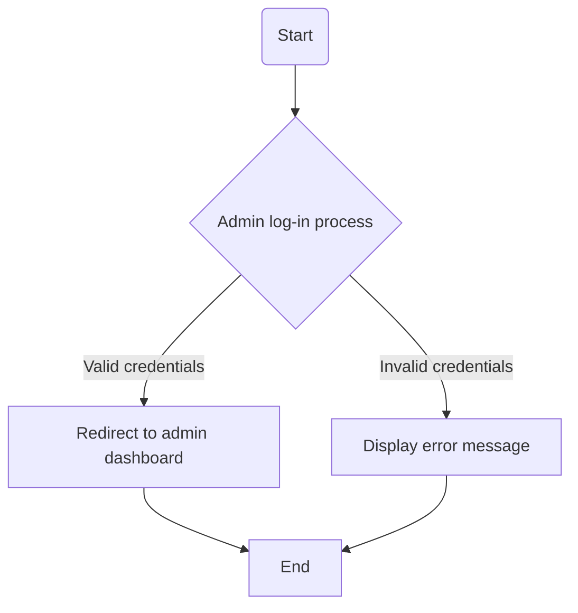
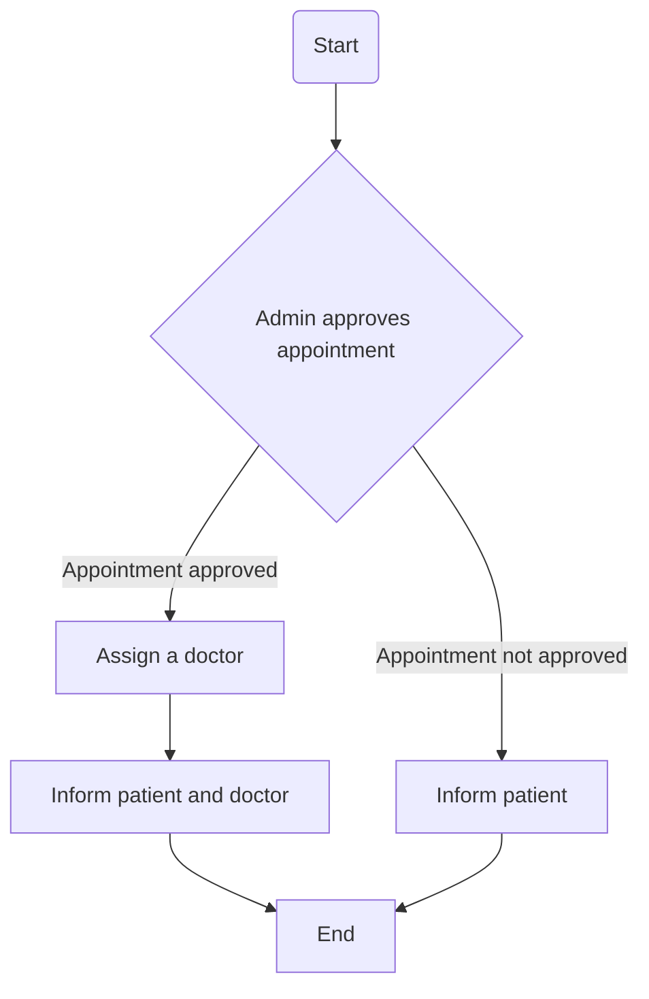

# Design, Development, and Testing of a Computer Programme Solution

## Part A – Design documentation (weight 10%)

### Overview of hospital management systems

In this coursework, students will create a 'prototype' Hospital Management system. This system aims to maintain the medical records of the patient, maintain the contact details of the patient, and keep track of the appointment dates. There are three different types of users involved in a hospital management system: admin, doctor, and patient. Each of the above plays an important role in the hospital management system performing different tasks. Patients using the system can book online appointments. Their appointments are approved by the admin that also assigns a doctor to them.

### Flowchart 1: Admin Log-in Process

### Flowchart 2: Admin Approving an Appointment

## Part B – System development (weight 30%)

### Important:

This part of the assessment should not be attempted by students until you are provided with the partial implementation code which you must use as a starting point of your system, and this will be provided to you around Week 8 of this semester.

Developing your hospital management system from scratch is not acceptable for this assessment, and may lead to losing a substantial amount of marks.

It is critical to use Python 3.6 or a higher version of Python and "Spyder" IDE to ensure that your submission runs correctly when marked by your tutor.

### Description:

#### Rationale

This programming assignment is to apply the programming principles covered in tutorials and lectures to develop a Python software that implements a core hospital management solution that is used by its patients and staff members. The software can be fully implemented using a text-based interface; however, to achieve higher marks, a GUI-based software can be developed using the Python GUI Programming module namely Tkinter. GUI design and Tkinter programming will be covered during week 10. The aim of the exercises is to enhance a student's experience of programming by applying programming principles to a larger problem of developing a complete application.

There are mainly two reasons behind the selection of the hospital management system as the topic of this coursework. Firstly, the students are familiar with this system; hence, students will spend less time and effort to understand the function specification of the software they will be developing for this coursework. Hence, most of their time will be devoted to the design, development, and testing of the system by applying the programming knowledge and skills they learned throughout this module. Secondly, GUI-based programs make it easier to interact with the developed system and demonstrate a direct relationship between the user interaction and the system functions and data. Also, students will learn about how a product works entirely from the user's (or customer's) perspective and not just from a developer perspective. Hence, they will need to develop a user-friendly GUI.

#### Objective - Sample prototype application

The objective of this assessment is to develop a Python software that implements a core hospital management solution that is used in hospitals by its patients and hospital admins. A partial implementation of a prototype system will be developed during the practical sessions in the PC labs. This prototype will be developed to include basic system functionalities such as book an appointment and display patients' data by doctors. The main class will allow adding a number

.
